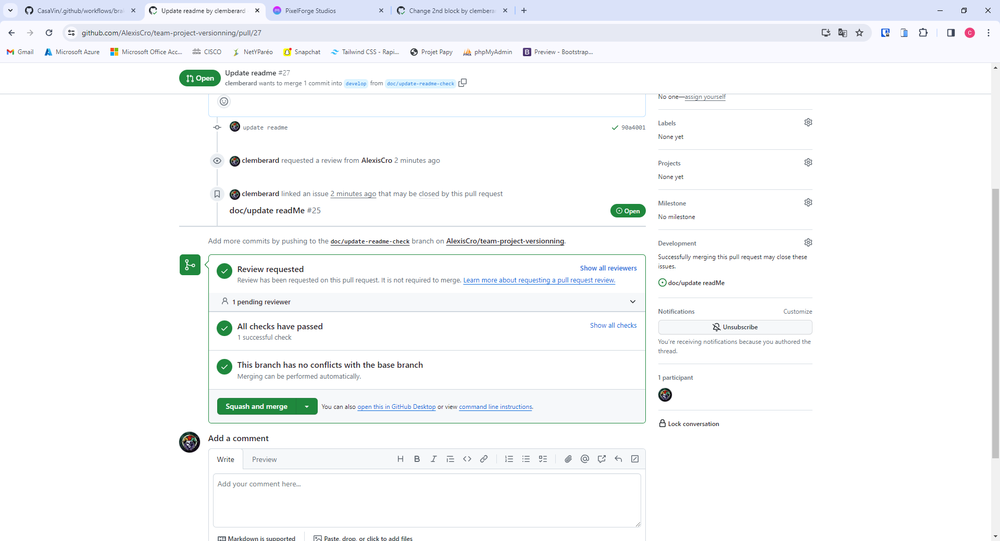
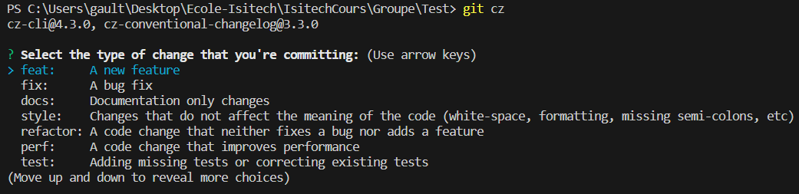
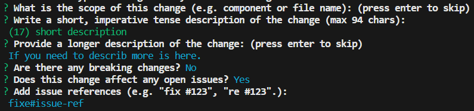
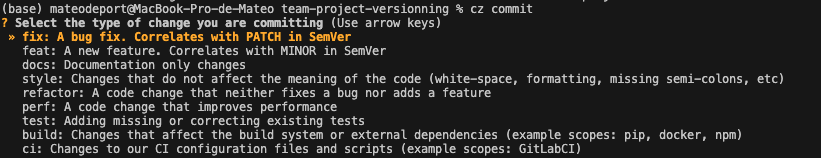
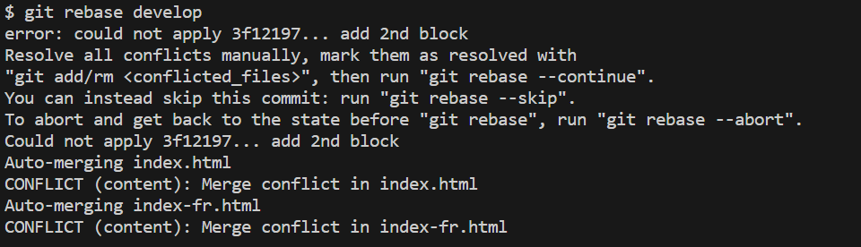
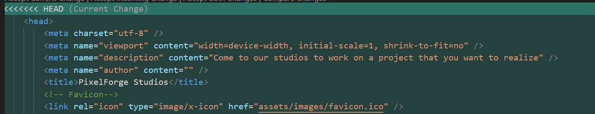
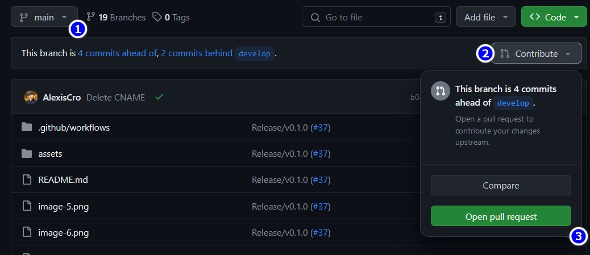
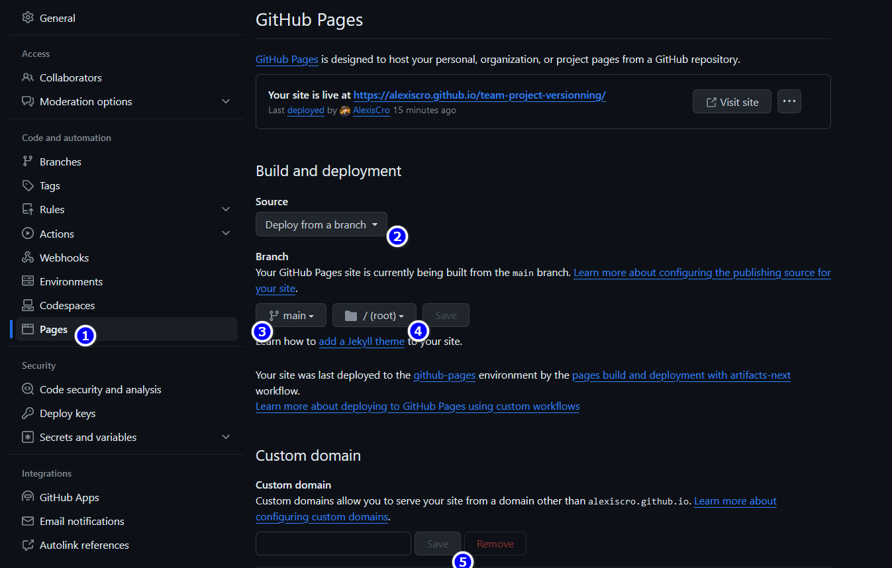
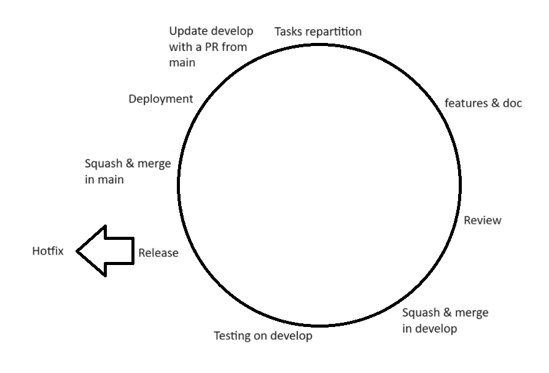

# Team Project Versionning

## Summary

- [Topic](#our-topic)
- [Git flow](#git-flow)
  - [Branches](#our-branches)
  - [How it works](#how-git-flow-works)
- [GITHUB workflow](#our-github-worflow)
  - [Issues](#create-an-issue)
  - [Board](#our-project-board)
  - [PR](#our-pr)
- [Checks](#check-after-push)
  - [html5validator](#html5validator)
- Tools
  - [Commitizen](#commitizen)
- Help / FAQ
  - [Manage conflicts](#manage-conflicts)
  - [Problem encounter](#problem-encountered)
- [Deployment workflow](#our-deployment-workflow)
- [In production](#our-application-in-production)

## Our topic

We will create a static website of video game e-market.

## Git flow

### Our branches

To be efficiently we will respect a name convention to create our branches :

- feature : feature/_subject-of-the-feature_
- patch or fix of bug : fix/_bug_
- hotfix : hotfix/_bug_
- release : realease/_name-of-PR_
- support : support/_problem_
- documentation : doc/_which-doc_

These configuration are set with git flow, so to use it please follow these steps:

- run `git flow init`
- choose main for production
- choose develop for integration
- 

**Warning : For documentation branch you can't use git flow so follow these step**

```bash
# From your branch develop
git checkout -b doc/<which-doc>
```

#### How git flow works ?

So when you want to create a new feature in our project please start from develop branch and enter this command :

```bash
git flow feature start *name-of-your-feature*

# for instance
# for a feature change application name
git flow feature start modify-application-name
```

### Our GITHUB worflow

Each modification in the project need an issue and a PR (Pull-Request). And each issue needs to be link to the project [board](https://github.com/users/AlexisCro/projects/4).

#### Create an issue

In GITHUB click on Issues


Then you'll get this page so click on New issue


Finally to create the issue please fill these fields


1. Add title to the issue following our convention (feature/ , doc/ , etc...)
2. Describe why we need to do this
3. Assign yourself to the issue
4. Add adequat label (your label + type issue label (doc, feature, etc))
5. Add to the milestone

#### Our project board


As you can see we have different columns in our project board. Each column identify an issue status so please put you issues in the correct column according to their status.

#### Our PR

You need to link the issue to the PR. To do that you need to add in the PR description the following line :

```md
# Num of the issue

#num-issue
```

You need also to describe what you have done in the PR.

```md
# Description

lorem ipsum dolor sit amet
```

You need to add some images if you can to show what you have done.

```md
# Screenshots


```

Finally you need to add reviewers to the PR. To do that you need to click on Reviewers and add the reviewer.

### Check after push

#### HTML5Validator

After push your code you need to check if the html5validator is ok. To do that you need to go at the end of the page (under reviews). You'll see a check of html5validator. If it's ok the branch can be merged. If this is not the case you need to fix the error (click on details), resolve and push again.


Here the [documentation](https://pypi.org/project/html5validator/)

#### How to install locally

Install with `pip install html5validator`
Then you can run the validator with `html5validator`

## Commitizen

### Install NPM

You need to install NPM if you don't have it.<br>
[Download NPM here](https://nodejs.org/en/download)

### Install Commitizen

On your command terminal run :

```sh
npm install -g commitizen
```

You need to install an CZ adapter :

```sh
npm install -g cz-conventional-changelog
```

### Configuration

If you don't have a `package.json`, create it with :

```sh
npm init
```

Now add on the file :

```js
"config": {
  "commitizen": {
    "path": "cz-conventional-changelog"
  }
}
```

### How to use it ?

Now you can use Commitizen.<br>
Use this command line instead of `git commit` :

```sh
git cz
```

### How it work ?

After do th command line, this happened :<br>

1. Select the type of change :<br>
   
2. Add the detail you need of your commit : (picture is for showing the question and the process)<br>
   
   After this this, your commit is done.<br>
   You can push normally your code.

### If you are on Mac OS for install Commitizen

You need to install Commitizen with homebrew.<br>

```sh
brew install commitizen
```

### How to use it ?

Now you can use Commitizen.<br>
Use this command line instead of `git commit` :

```sh
cz commit
```

### How it work ?

After do th command line, this happened :<br>

1. Select the type of change :<br>
   
2. Add the detail you need of your commit : (picture is for showing the question and the process)<br>
   

## Manage conflicts

Sometimes when you will pull the develop branch and rebase develop on your other branches to up to date them you could meet conflicts.

### Problem encountered

#### First problem

The first problem encountered was when I wanted to retrieve the latest updates from the "develop" branch, and then rebase on my
Branch `feature/edit-third-slide`. Which I was working on. I handled conflicts poorly. And so there were too many problems on the page because it had doubled a lot of lines and badly indented all the code. I was therefore forced to recreate a v2 branch `feature/modification-third-slide-v2` to start again without making errors in conflicts.

#### Second problem

the second problem encountered was when creating the second branch: `feature/modification-third-slide-v2`.
After doing a `git pull` on my `develop` branch locally. Then I did a rebase of develop on my branch `feature/modification-third-slide-v2` `git rebase develop` and I did the rebase incorrectly which created a problem on my branch develop and my branch dev.
Following an analysis this created big problems on my develop branch.
Which forced me to delete my local repository and recreate it with `git clone`

### How to manage and resolve conflicts ?

When you will do the rebase or your update of your branch you could have a message like this


Follow these steps to resolve them :

- run `git status`
- see file both modified
- go to file with your editor
- you should see something like this
  
  Conflict are highlighted by

```bash
<<<<HEAD
  ...
====
  ...
>>>>>>ID commit
```

- Check what is the correct and functional code highlighted by your editor and git and remove or adapt code as it's needed.
- Then to mark your resolve run `git add <file-resolve>`
- If all conflict are resolved run `git rebase --continue` in the case of a rebase.
- Then to push on tthe remote repository you will need to run `git push --force-with-lease` instead of `git push`

## Our deployment workflow

At the end of each sprint and to prepare release we create a new branch following this convention naming :

```bash
git branch release/<release-version>

# For instance
git branch release/v0.1.0
```

Then we do whole hotfix from this branch by adding commit to this one.

_For instance_

_We have seen two problems in our branch develop so we will fix them in the branch release by adding updates and each update = one commit following this naming `hotfix/<topic>`._

**Obviously each commit is realized with comitizen**

After whole hotfix realized we verify if the html5validator check is ok. If it's the case so we can merge our release branch in `main`.

### Update develop

After merging release in main we need to update develop.
So we will create a pull request on GITHUB from main



1. First go on the branch main on GITHUB
2. Click on Contribute
3. Chose Open pull request
4. Create the PR as usually

**Resolve conflict on GITHUB if it's needed**

5. Ask a review
6. If review is accepted squash & merge your PR in develop
7. Tell at your team to pull develop to be up to date.

## Our application in production

### GITHUB pages

Our application is deployed via GITHUB pages.



These actions is i your project settings.

1. Go to Pages section
2. Chose 'Deploy from a branch', default choice normally
3. Chose the production branch
4. Chose the file where there is the index page.
5. You can custom your domain, if you to do this please follow this [documentation](https://docs.github.com/fr/pages/configuring-a-custom-domain-for-your-github-pages-site/about-custom-domains-and-github-pages) but a check of DNS is required so that your app will not instanly deployed. If you don't want a custom domain click just on save.
6. Yous app is deployed :rocket:

## Our first release

### First steps

We began by create a new repository on GITHUB and give access to all team members. Then we chose a bootstrap theme to help us by saving time and to have the possibilituy to be focused on our workflow.

Then we update the template, each members did a feature, stage their changes, commit them and push to create a PR and ask a review.
If the review and checks is ok so we can squash and merge.

### Prepare release

At the end of the first sprint we created our first branch release and realize whole hotfix which are needs.
After that we merge the release branch in our main branch (production branch).

### Deployement

After the release step we deployed our main branch from GITHUB pages.

### Sprint cycle



## Problem encountered

### First problem

The first problem encountered was when I wanted to retrieve the latest updates from the "develop" branch, and then rebase on my
`feature/modification-third-slide` branch. That I was working on.I handled conflicts poorly. And as a result there were too many problems and therefore I was forced to recreate a v2 branch `feature/modification-third-slide-v2` to start again without making any errors in the conflicts.
