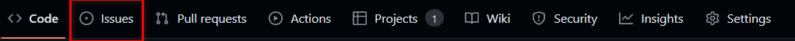
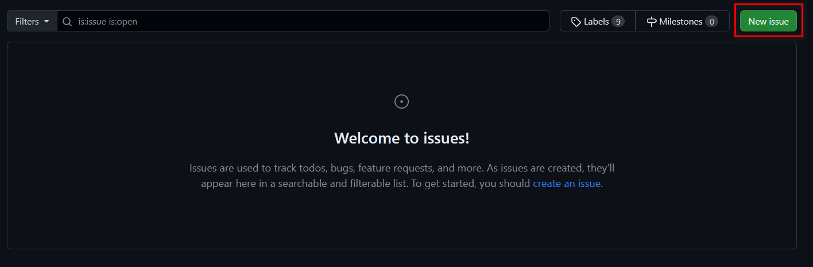
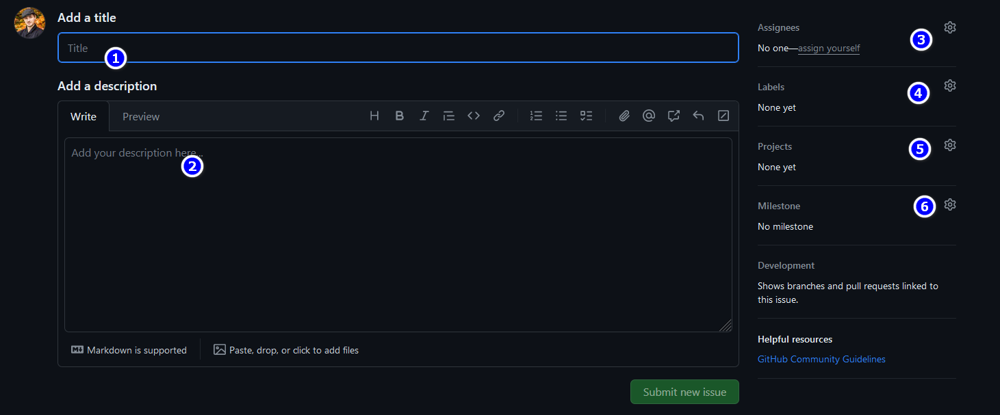
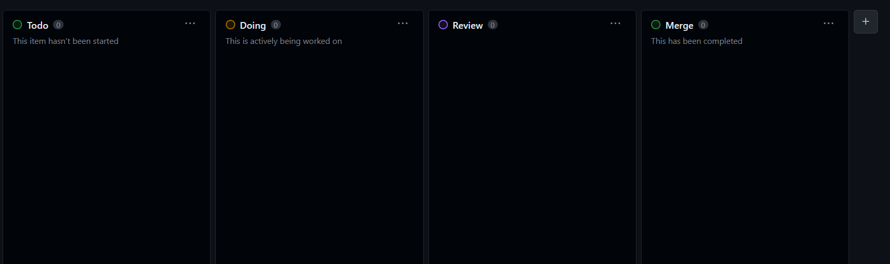

# Team Project Versionning
## Our topic 
We will create a static website of video game e-market. 

## Git flow
### Our branches 
To be efficiently we will respect a name convention to create our branches :
- feature : feature/*subject-of-the-feature*
- patch or fix of bug : fix/*bug*
- hotfix : hotfix/*bug*
- release : realease/*name-of-PR*
- support : support/*problem*
- documentation : doc/*which-doc*

These configuration are set with git flow, so to use it please follow these steps: 
- run `git flow init`
- choose main for production
- choose develop for integration
- 



**Warning : For documentation branch you can't use git flow so follow these step**
```bash
# From your branch develop 
git checkout -b doc/<which-doc>
```

#### How git flow works ? 
So when you want to create a new feature in our project please start from develop branch and enter this command :
```bash
git flow feature start *name-of-your-feature*

# for instance
# for a feature change application name 
git flow feature start modify-application-name
```

### Our GITHUB worflow
Each modification in the project need an issue and a PR (Pull-Request). And each issue needs to be link to the project [board](https://github.com/users/AlexisCro/projects/4).

#### Create an issue
In GITHUB click on Issues


Then you'll get this page so click on New issue


Finally to create the issue please fill these fields

1. Add title to the issue following our convention (feature/ , doc/ , etc...)
2. Describe why we need to do this
3. Assign yourself to the issue
4. Add adequat label (your label + type issue label (doc, feature, etc))
5. Link to our project
6. Add to the milestone

#### Our project board


As you can see we have different columns in our project board. Each column identify an issue status so please put you issues in the correct column according to their status. 

#### Our PR
You need to link the issue to the PR. To do that you need to add in the PR description the following line :

```md
# Num of the issue
#num-issue
```

You need also to describe what you have done in the PR.

```md
# Description
lorem ipsum dolor sit amet
```

You need to add some images if you can to show what you have done.

```md
# Screenshots

```

Finally you need to add reviewers to the PR. To do that you need to click on Reviewers and add the reviewer.